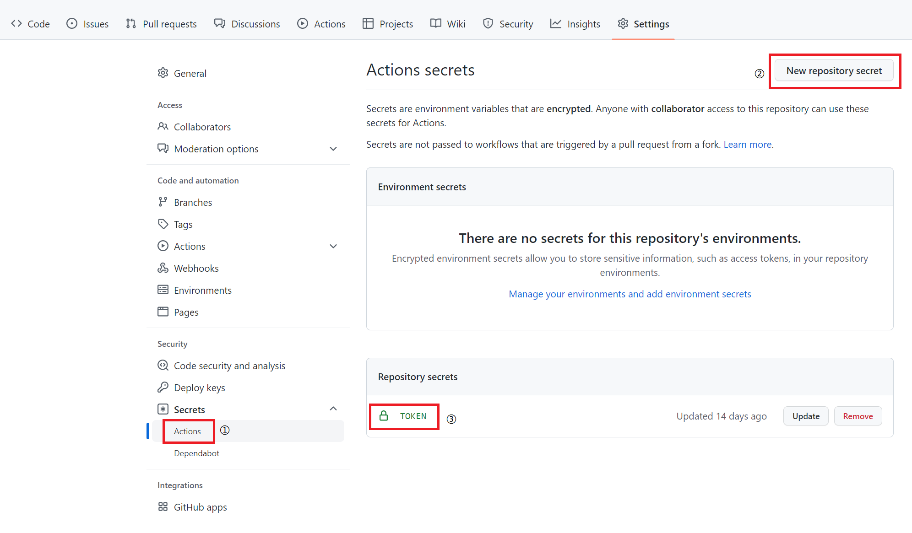
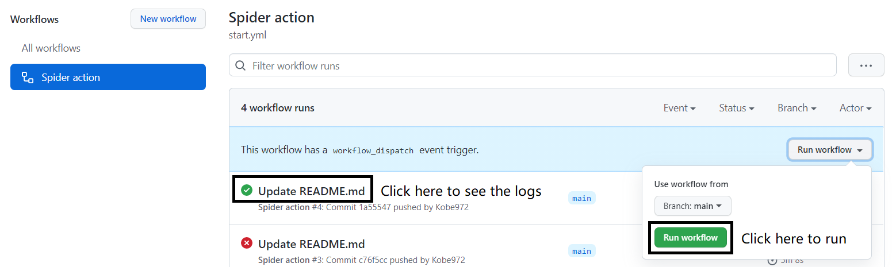
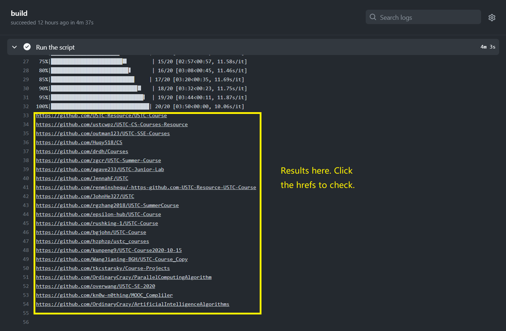
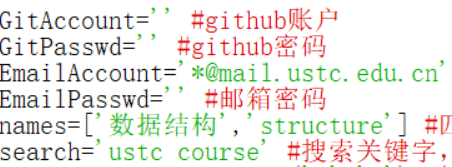
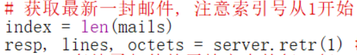

# 介绍
本项目专门为考试周找不到往年试卷的科大学生定制，它可以在ustc-course相关的180+个仓库上高效爬取需要的课程资料，为了提升速度以及避免使用协议带来的困难，项目部署在github action上。  

# 使用说明
## 终端版本
命令行启动：
```shell
python terminal_version.py <LOGIN> <PASSWORD> <MAIL> <MAILPASSWORD>
```
其中LOGIN是GitHub用户名，PASSWORD是GitHub密码，MAIL是GitHub绑定的邮箱，这里默认科大邮箱，如果不是请参见附注修改代码，MAILPASSWORD是邮箱密码。  
workflow启动：  
1、将代码fork到自己的仓库。  
2、点击Actions选项卡，点击`I understand my workflows, go ahead and enable them`。  
3、在Settings/Secrets设置四个Secret：LOGIN、PASSWORD、MAIL、MAILPASSWORD，对应github用户名、github密码、邮箱地址、邮箱密码。  

4、在Action选项卡中启动workflow，运行结果可在日志中看到。


## 本地selenium脚本
编辑代码，将开头用户名、密码信息填写完整，并填上你想搜的课程，点击文件运行，搜索结果见同目录下的findings.txt。注意两种方式下必须保证脚本和mail.py在同一目录下。  

# 优点
1、可以辅助提升GPA，助你成为卷王。  
2、比起手动寻找仓库，速度要快十几倍，而且支持并行搜索（同时开启几个workflow即可）。  
3、可以爬取整个目录，而不是view code中显示的一层。
# 常见问题
1、使用selenium脚本时报错，说find_element_by_xpath('.//pre')未找到相关元素：原因很可能是登录失败，请检查您的用户名和密码。  
2、邮箱验证码获取错误：脚本会不断刷新邮箱，并获取最新一封未读邮件，然后检测该邮件是否包含github验证码。如果之前的验证邮件未读，则可能被程序识别为当前的验证邮件。  
3、邮箱登录超时：重新打卡github，尝试再运行。  
4、github无法登录，去掉无头模式后显示用户名或密码错误：找回密码，我遇到过这个问题但是不知道为什么，开发过程中共遇到两次这样的问题。
# 附注
1、经实验验证，部署在github上的脚本比在本地开vpn（clashX）运行速度快将近三倍，因此推荐使用workflow。  
2、如果不知道如何使用workflow，请参考https://github.com/Kobe972/USTC-ncov-AutoReport ，这个仓库中有使用workflow的详细例子。  
3、邮箱必须是github注册的邮箱，因为要收github发来的验证码。代码中默认是ustc邮箱，如果不是，应该把代码中pop3服务器地址更改，并且关注最新未读邮件的索引。ustc邮箱中最新未读邮件的索引是1，如果您的邮箱和这不同，也需要修改相应代码。最新邮件提取代码如图所示：  
  
4、脚本也可做其他用途，它的主要功能是在一堆仓库中找出包含某类文件的仓库（比如文件名含有某些字符串）。
